# kyma-helloworld-nodejs

 

#### Install dependencies

 

npm install

 

#### Run application locally

 

npm start

 

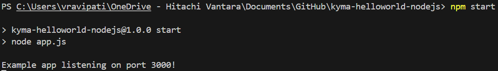

 

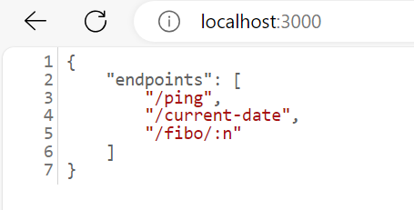

 

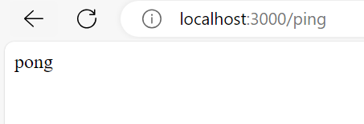

 

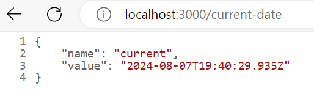

 

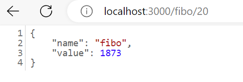

 

#### Build container image using docker file

 

docker build -t ravipativenu/kyma-helloworld-nodejs:latest .

 

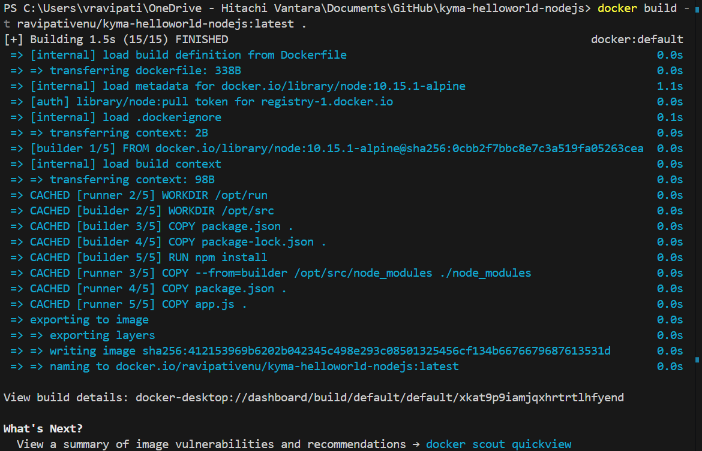

 

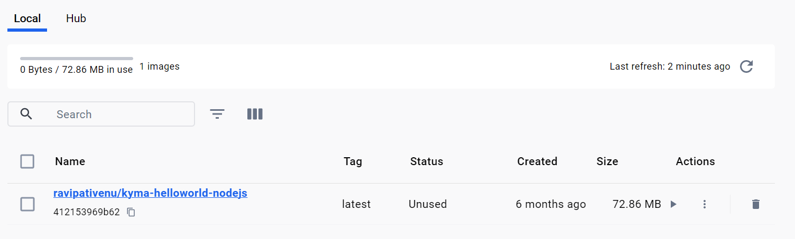

 

#### Run the container

 

docker run -d -p 3000:3000 ravipativenu/kyma-helloworld-nodejs:latest

 

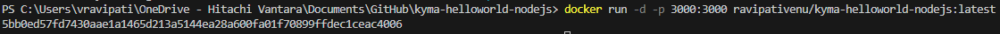

 

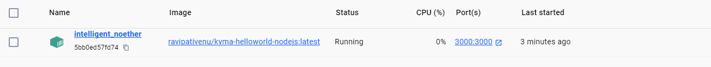

 

Explore container image fiels and open them

 

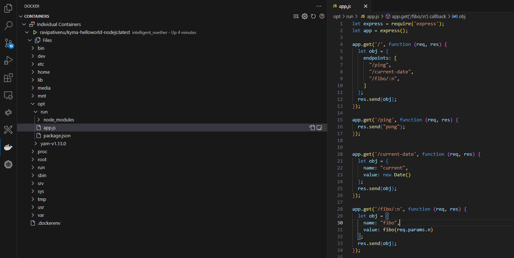

 

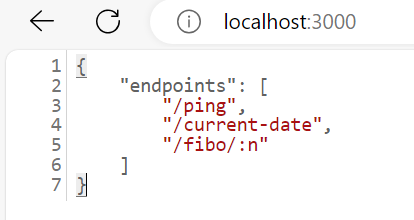

 

#### Push container image to docker registry

 

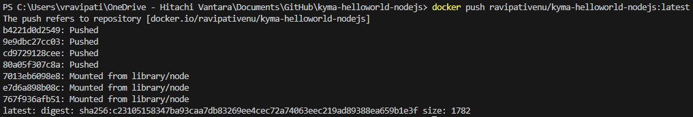

 

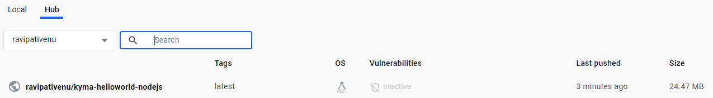

 

#### Deploy application to kubernetes using Deployment

 

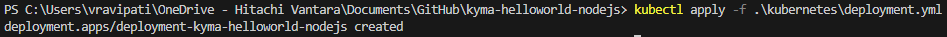

 

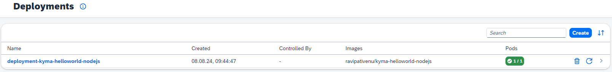

 

| Kubernetes Object           | Details          |
| --------------------------- | --------------- |
| ***Deployment***                  | ***Name***: deployment-kyma-helloworld-nodejs   ***Pod Name***: deployment-kyma-helloworld-nodejs-7684d89f54-slg6j |
| ***Replica Set***                 | ***Name***: deployment-kyma-helloworld-nodejs-7684d89f54   ***Controlled By***: Deployment (deployment-kyma-helloworld-nodejs)   ***Limits***: CPU, Memory   ***Requests***: CPU, Memory      ***Pod Name***: deployment-kyma-helloworld-nodejs-7684d89f54-slg6j                |
| ***Pod***                         | ***Name***: deployment-kyma-helloworld-nodejs-7684d89f54-slg6j    ***Controlled By***: ReplicaSet (deployment-kyma-helloworld-nodejs-7684d89f54)   ***Containers***: kyma-helloworld-nodejs-container   ***Image***: ravipativenu/kyma-helloworld-nodejs|

 

View container logs

 

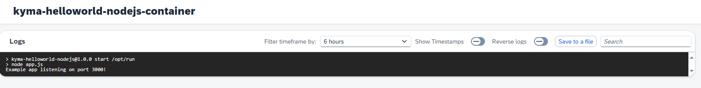

 

## Create Service - Load balancer

 

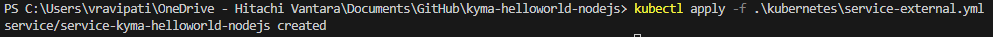

 

| Kubernetes Object     | Details          |
| --------------------- | --------------- |
| ***Deployment***      | ***Name***: deployment-kyma-helloworld-nodejs   ***Pod Name***: deployment-kyma-helloworld-nodejs-7684d89f54-slg6j  |
| ***Replica Set***     | ***Name***: deployment-kyma-helloworld-nodejs-7684d89f54   ***Controlled By***: Deployment (deployment-kyma-helloworld-nodejs)   ***Limits***: CPU, Memory   ***Requests***: CPU, Memory      ***Pod Name***: deployment-kyma-helloworld-nodejs-7684d89f54-slg6j                 |
| ***Pod***             | ***Name***: deployment-kyma-helloworld-nodejs-7684d89f54-slg6j    ***Controlled By***: ReplicaSet (deployment-kyma-helloworld-nodejs-7684d89f54)   ***Containers***: kyma-helloworld-nodejs-container   ***Image***: ravipativenu/kyma-helloworld-nodejs|
| ***Service***         | ***Name***: service-kyma-helloworld-nodejs   ***Service Type***: LoadBalancer   ***Cluster IP***:
100.108.48.232   ***Ports***: (80) --> (3000)   ***External IPs***: a7153076705b24c29b73ce3379116f5e-154082666.us-east-1.elb.amazonaws.com   ***Pod***: deployment-kyma-helloworld-nodejs-7684d89f54-slg6j                                                                                                            |

 

## Test service

 

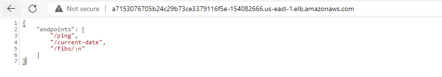

 

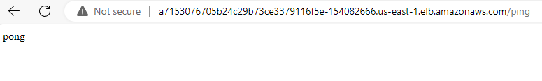

 

