

env - loadenv - loadenv

 

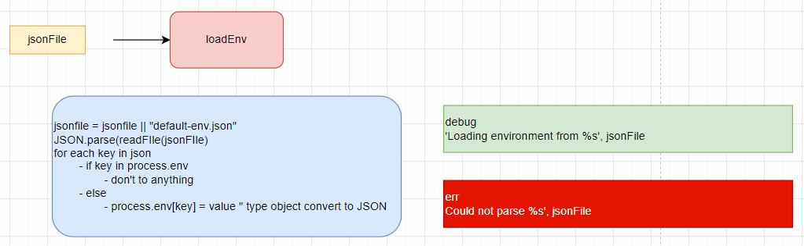

 

 
 

env - xsservices - loaddefaultservices

 

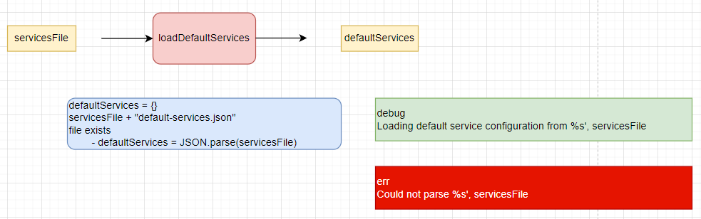

 

 
 

env - xsservices - readservices

 

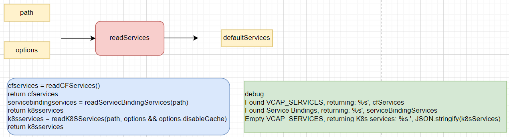

 

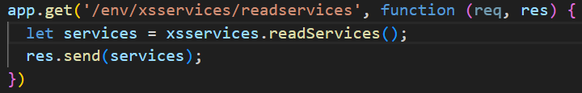

 

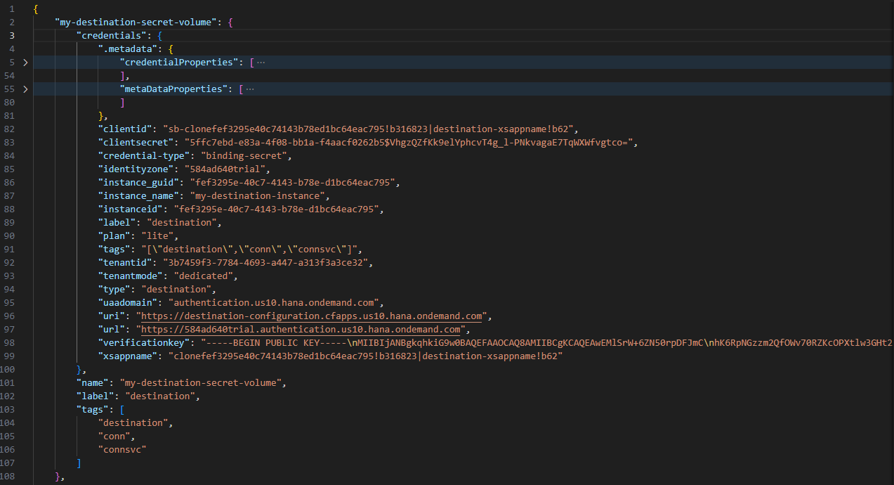

 

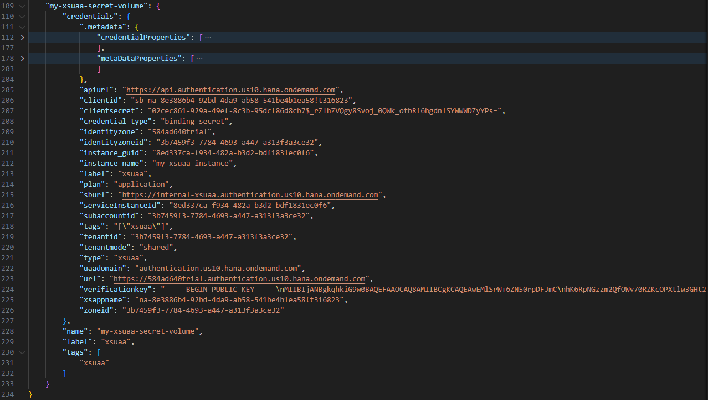

 

 
 

env - xsservices - filterServices

 

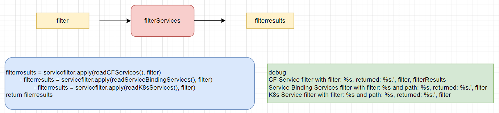

 

 
 

 
 

env - cfservice - readCFServices

 

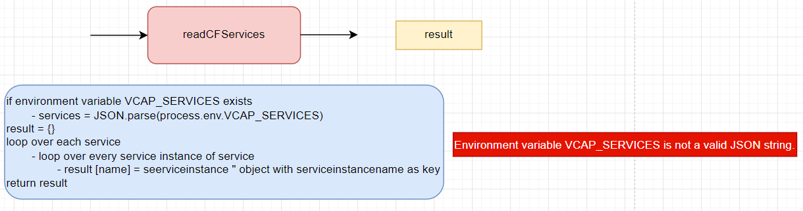

 

 
 

env - servicebindingservice - readservicebindingservices

 

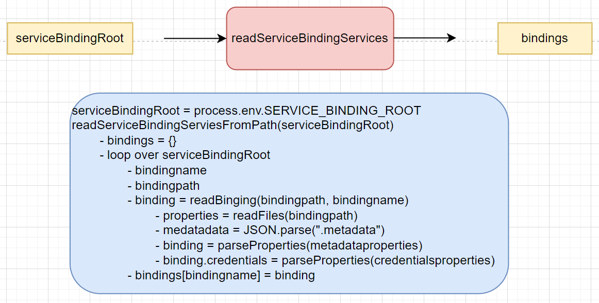

 

## Testing

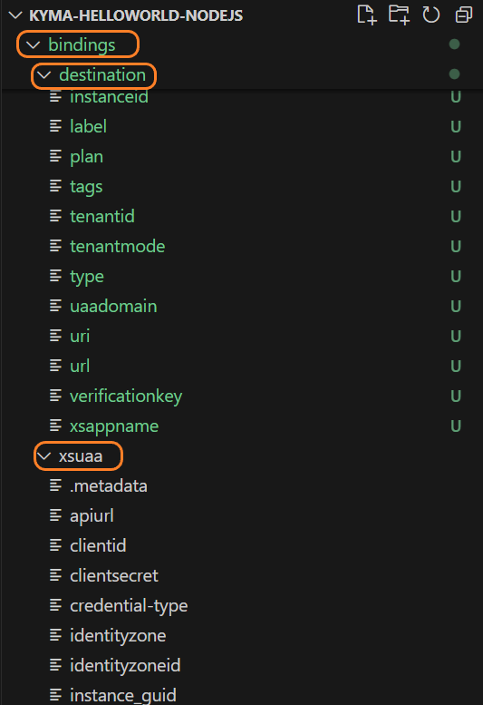

 

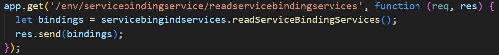

 

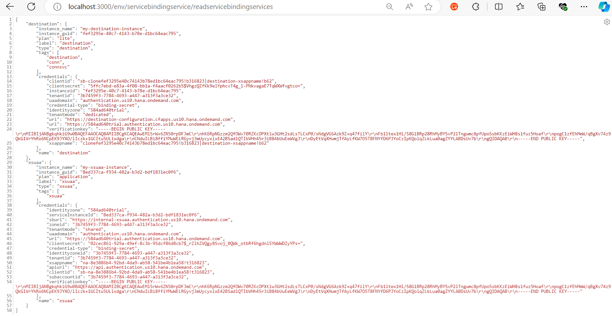

 

 
 

env - servicebindingservice - readfiles

 

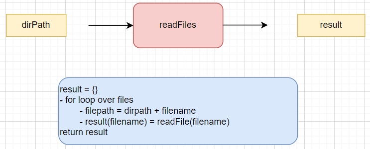

 

#### Testing

 

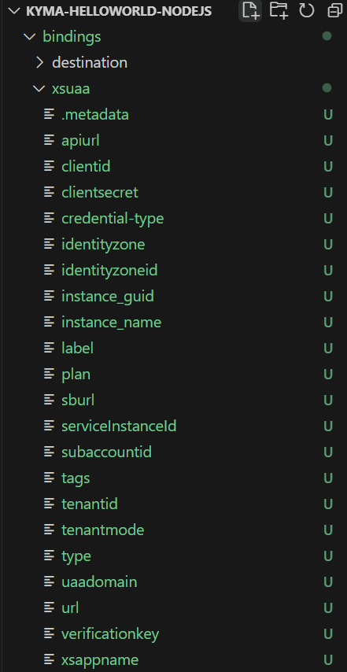

 

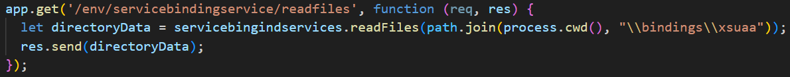

 

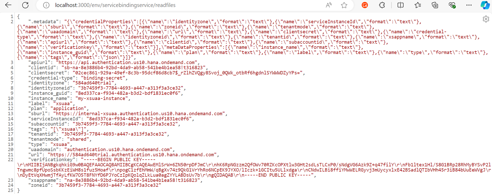

 

 
 

env - k8sservice - readk8sservices

 

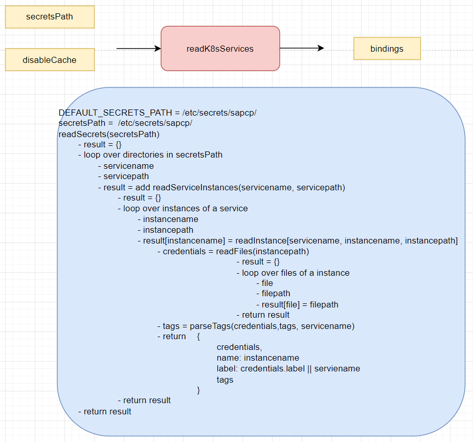

 

#### Testing

 

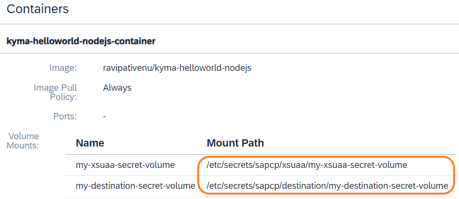

 

 

 

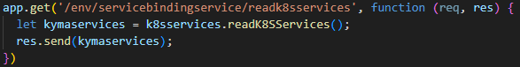

 

 
 

env - k8sservice - readSecrets

 

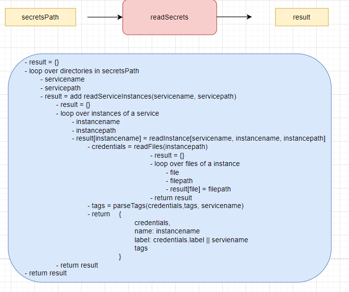

 

 
 

env - k8sservice - readServiceInstances

 

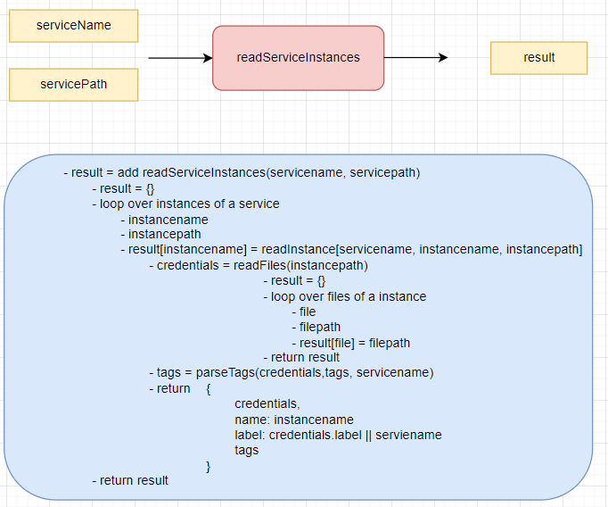

 

 
 

env - k8sservice - readInstance

 

 

 
 

env - k8sservice - readFiles

 

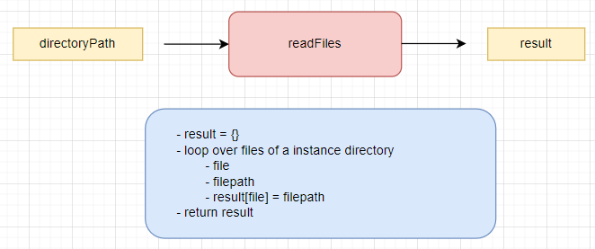

 

 
 

env - k8sservice - readFileContent

 

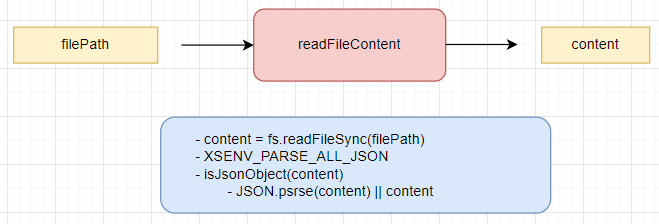

 

 
 

env - k8sservice - isJsonOject

 

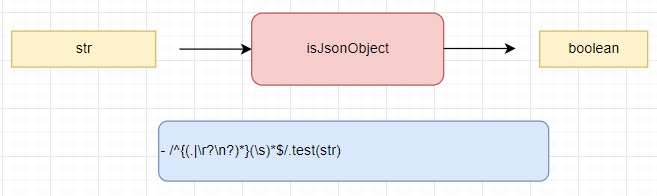

 

 
 

env - k8sservice - parseTags

 

 

 
 

env - cacert - loadcCertificates

 

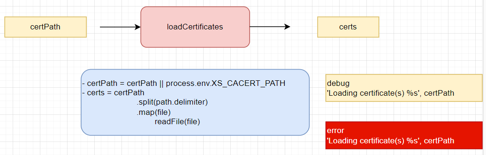

 

#### Testing

 

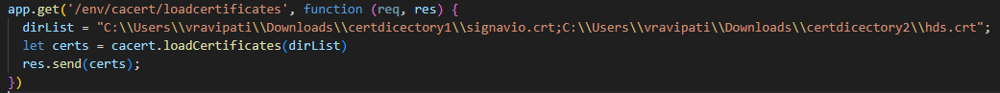

 

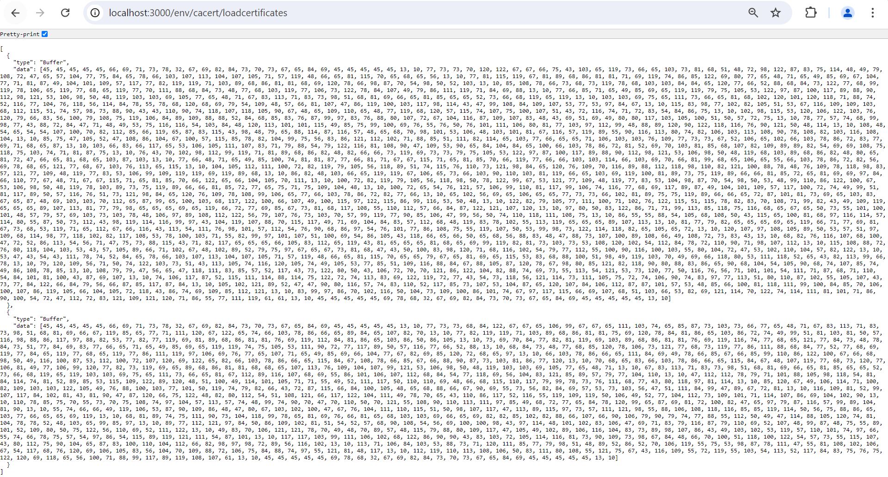

 

