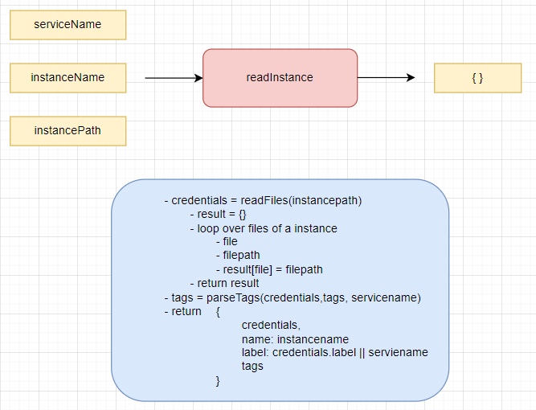
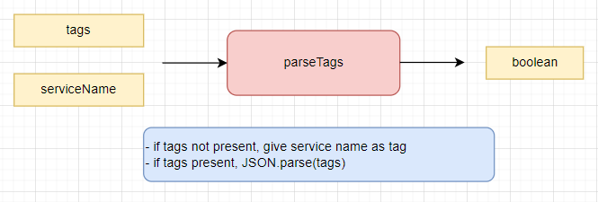

env - xsenv

 

 

 
 

env - servicebindingservice - readservicebindingservices

 

 

## Testing

 

 

 

 
 

env - servicebindingservice - readfiles

 

 

#### Testing

 

 

 

 

 
 

env - k8sservice - readk8sservices

 

 

#### Testing

 

 

 

 

 

 
 

env - k8sservice - readSecrets

 

 

 
 

env - k8sservice - readServiceInstances

 

 

 
 

env - k8sservice - readInstance

 

 

 
 

env - k8sservice - readFiles

 

 

 
 

env - k8sservice - readFileContent

 

 

 
 

env - k8sservice - isJsonOject

 

 

 
 

env - k8sservice - parseTags

 

 

