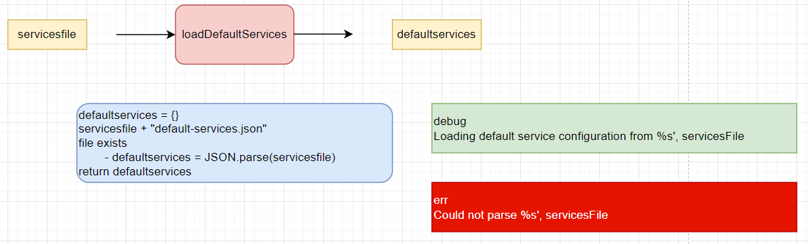
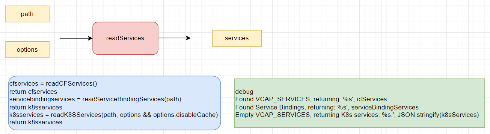

xsenv - loadenv - loadEnv

 

 

#### Testing

 

 

 

 

 
 

xsenv - xsservices - loadDefaultServices

 

 

#### Testing

 

 

 

 

 
 

xsenv - xsservices - readServices

 

 

 

 

 

 
 

xsenv - xsservices - getServices

 

 

#### Testing

 

Object

 

 

 

Function

 

 

 

 

 
 

env - xsservices - filterServices

 

 

 
 

xsenv - cfservice - readCFServices

 

 

#### Testing

 

VCAP_SERVICES from CF

 

 

 

 

 
 

xsenv - servicebindingservice - readServiceBindingServices

 

 

## Testing

 

 

 

 
 

xsenv - servicebindingservice - readFiles

 

 

#### Testing

 

 

 

 

 
 

xsenv - k8sservice - readK8SServices

 

 

#### Testing

 

 

 

 

 

 
 

xsenv - k8sservice - readSecrets

 

 

 
 

xsenv - k8sservice - readServiceInstances

 

 

 
 

xsenv - k8sservice - readInstance

 

 

 
 

xsenv - k8sservice - readFiles

 

 

 
 

xsenv - k8sservice - readFileContent

 

 

 
 

xsenv - k8sservice - isJsonOject

 

 

 
 

xsenv - k8sservice - parseTags

 

 

 
 

xsenv - cacert - loadCertificates

 

 

#### Testing

 

 

 

